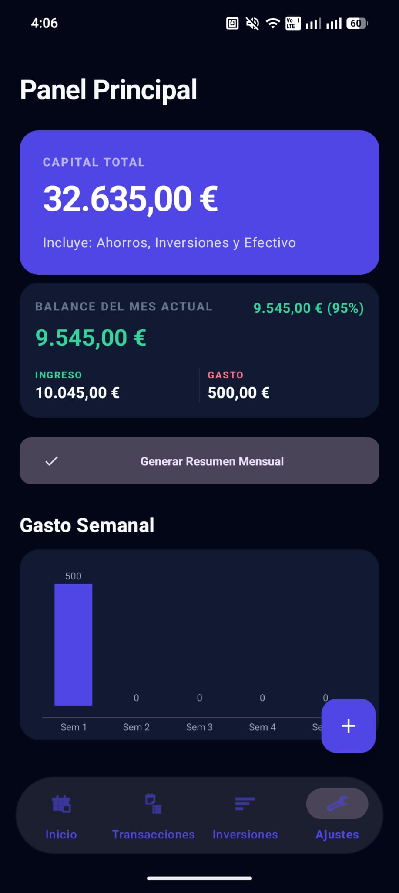
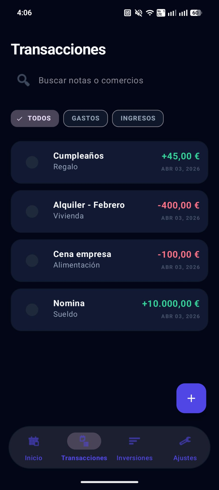
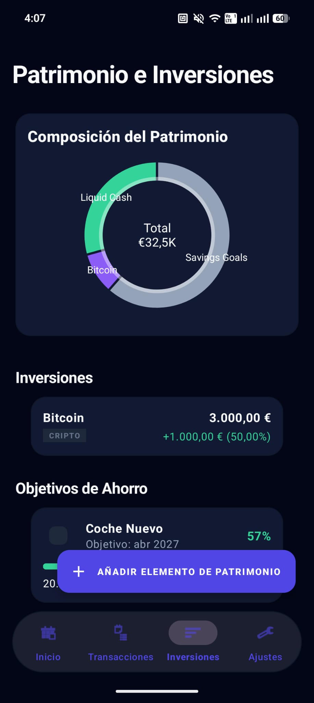

# Kpital 📊

**Your complete financial ecosystem, seamlessly bridging everyday expenses with long-term investments.**

 

  
  

⚠️ *Please note: This is a professional showcase project. It is not connected to any real banking institution or live accounts. The source code is maintained privately.*

[**🌐 View Live Web Preview**](https://issam22330.github.io/Issam-portfolio.github.io/projects/kpital.html) &nbsp;&nbsp;•&nbsp;&nbsp; [**📱 Download App (APK)**](./app-release.apk)

 

## 🚀 Why Kpital?

Typical finance apps force you to choose: track your budget *or* monitor your investments. **Kpital unifies both.** 

It is engineered as a comprehensive financial system built for clarity. By securely combining actionable daily expense data with broader portfolio insights, Kpital provides a holistic, real-time snapshot of your net worth—empowering smarter financial decisions in seconds.

 

## ✨ Core Features

* **Smart Expense Tracking** 💰
  Capture every transaction effortlessly. Instantly categorize and monitor daily spending habits to stay on budget without the friction.
* **Intelligent Wealth Management** 📈
  Move beyond mere savings. Keep track of diverse investments and monitor portfolio growth right next to your checking account.
* **Actionable Insights** 💡
  Turn raw data into financial confidence. Visual charts and contextual summaries help you understand where your money flows and grows entirely on autopilot.
* **Lightning-Fast Synchronization** ⚡
  Experience fluid, instantaneous updates across all your financial inputs without waiting or manual refreshing.

 

## 🏗️ Project Highlights

Behind the seamless UI lies a robust and modern technical foundation, engineered for scale and maintainability:

- **Clean MVVM Architecture:** Employs industry-standard Model-View-ViewModel patterns to ensure complete separation of concerns and testability.
- **Real-Time Database (Firestore):** Leverages Firebase Firestore to deliver instantaneous data synchronization with a highly scalable, flexible NoSQL data model.
- **Unified Domain Models:** A robust data layer designed to resolve complex relationships between localized daily spending and dynamic market investments.
- **Premium UX/UI Implementation:** Features a detail-oriented, responsive design language that prioritizes accessibility and visual hierarchy.

 

## 📸 Application Interface

 

  <b>Dashboard</b> 
   
  

 

  <b>Transactions</b> 
   
  

 

  <b>Investments</b> 
   
  

 

 

  <i>The source code for Kpital is maintained privately. For inquiries or collaboration, please reach out via GitHub or through the portfolio website.</i>

